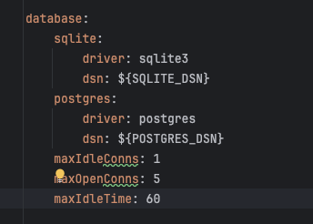
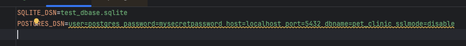

# [Viper](https://github.com/spf13/viper)
Viper is a complete configuration solution for Go applications.

## Pre-requisites
- Install Go 1.18 or later
- ZeroLog for logging
- Viper for configuration management

## Project Structure
```bash
├── `command`                                   // Command line interface for the application
│   └── server.go                               // Main entry point of the application
├── config                                      // Configuration files and related code
│   ├── app                                     // Application configuration package
│   │   ├── config.go
│   │   ├── database_config.go
│   │   └── info_config.go
│   ├── app-dev.yaml                            // Development environment configuration file
│   ├── app-prd.yaml
│   └── app.yaml                                // Default application configuration file
├── go.sum
└── .env
```

## Demo
This module demonstrates the Viper reading yaml configuration file and environment variables (env).  There are some sensitive, secret values that are not allowed to check into github such as database credential, API key, etc. To protect them, they require to store in env file, Hashicorp Consul, etcd3, aws parameter store, etc.  In this example, I will use Viper to read .env file. The ${SQLITE_DSN} and ${POSTGRES_DSN} are replaced with the values with these keys, SQLITE_DSN and POSTGRES_DSN. Print out the output to the console.

|                                                                              |                                                                |
|------------------------------------------------------------------------------|----------------------------------------------------------------|
|  |  |

