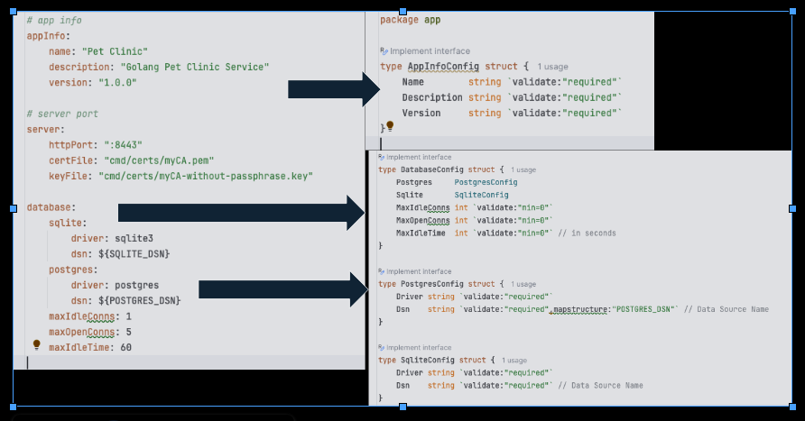

# [Viper](https://github.com/spf13/viper)
Viper is a complete configuration solution for Go applications

## Pre-requisites
- Install Go 1.18 or later
- ZeroLog for logging
- Viper for configuration management

## Project Structure
```bash
├── `command`                                   // Command line interface for the application
│   └── server.go                               // Main entry point of the application
├── config                                      // Configuration files and related code
│   ├── app                                     // Application configuration package
│   │   ├── config.go
│   │   ├── database_config.go
│   │   └── info_config.go
│   ├── app-dev.yaml                            // Development environment configuration file
│   ├── app-prd.yaml
│   └── app.yaml                                // Default application configuration file
└── go.sum
```

## Demo
This module demonstrates the Viper reading yaml configuration files and unmarshalling yaml into Go structs.  Print out the output to the console.




