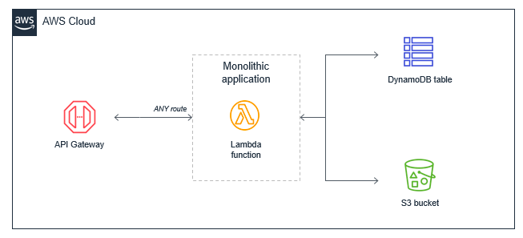
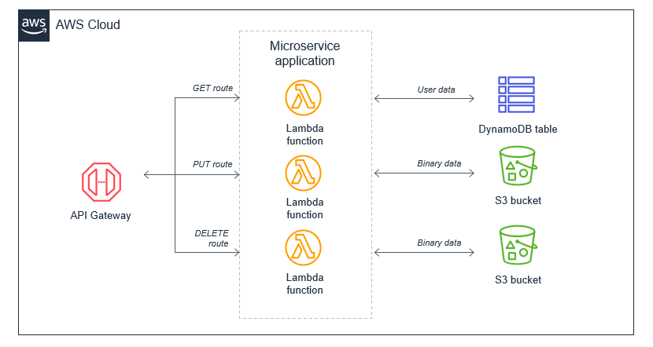
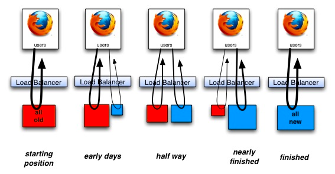

## AWS Lambda Patterns and Architecture
https://aws.amazon.com/blogs/compute/operating-lambda-understanding-event-driven-architecture-part-1/
https://aws.amazon.com/blogs/compute/operating-lambda-design-principles-in-event-driven-architectures-part-2/
https://aws.amazon.com/blogs/compute/operating-lambda-anti-patterns-in-event-driven-architectures-part-3/

## The Lambda monolith
A single Lambda function contains all the application logic.  For example, a monolithic Lambda function handles all Amazon API Gateway routes and integrates with all mecessary downstream resources:

This approach can have several drawbacks:
* Package size: 
* Harder to enforce least privilege:
* Harder to upgrade:
* Harder to maintain:
* Harder to reuse code:
* Harder to test:

The alternative is to decompose the monolithic Lambda function into individual microservices, mapping a single Lambda function to a single, well-defined task. In this example web application with a few API endpoints, the resulting microservice-based architecture is based on the API routes.

### Legacy Application Strangulation
https://paulhammant.com/2013/07/14/legacy-application-strangulation-case-studies/

### Step-through debugging Golang functions locally

https://docs.aws.amazon.com/serverless-application-model/latest/developerguide/serverless-sam-cli-using-debugging-golang.html

### bindata 
This package converts any file into manageable Go source code.  Useful for embedding binary data into a go program.  The file data is optionally gzip compressed before beig converted to a raw byte slic.

#### Installation:
go get -u github.com/shuLhan/go-bindata/... 

#### Usage
go-bindata data/...
go-bindata -o app/app.yaml.go config/...

#### Accessing an asset
data, err := Asset("pub/style/foo.css")
if err != nil {
	// Asset was not found.
}

// use asset data
convert []byte to io.Reader
r := bytes.NewReader(data)

#### Mockery
go to api/ecode and run this command: 
mockery --case=underscore --name=EcodeRepositorier  --inpackage

go to api/ecode and run this command: 
mockery --case=underscore --name=EcodeServicer  --inpackage 
