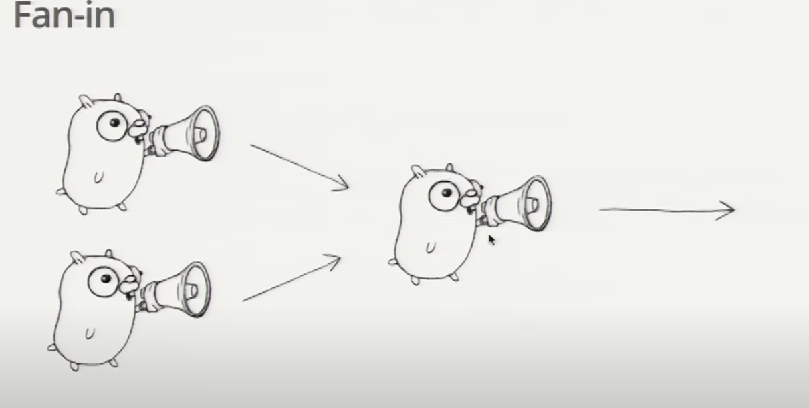
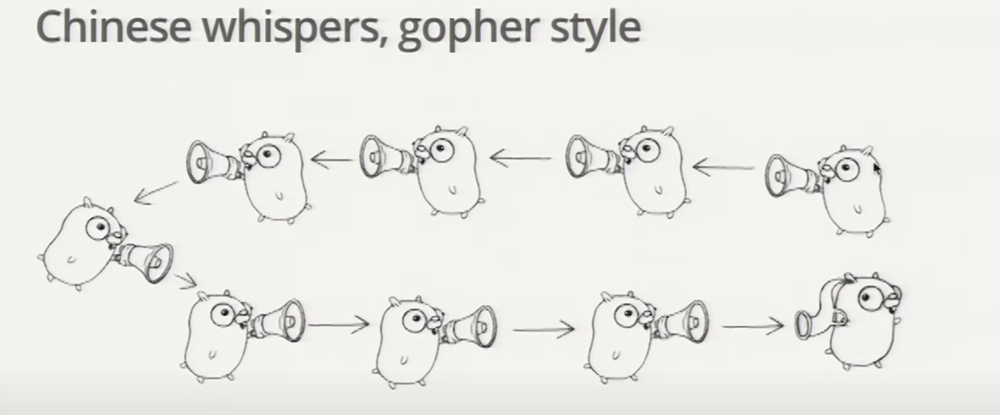
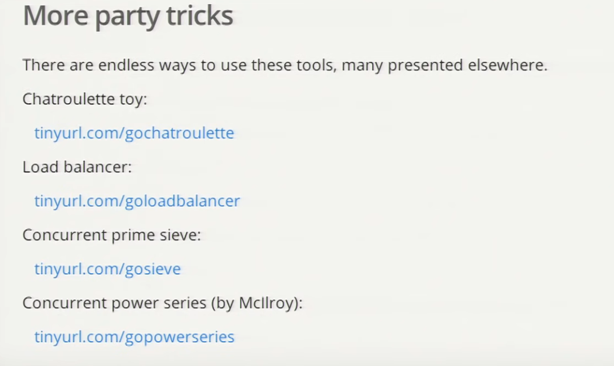
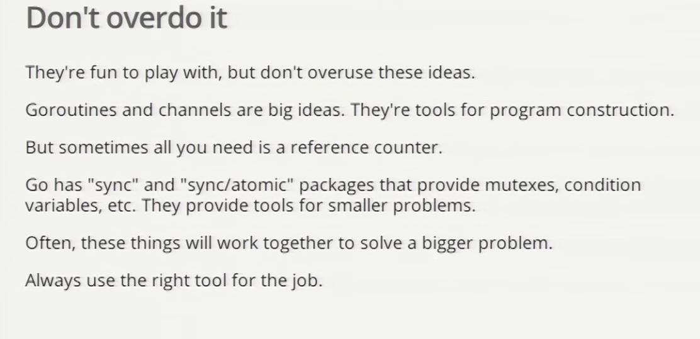

<!-- TOC -->
* [Concurrency Patterns](#concurrency-patterns)
    * [A boring function](#a-boring-function)
    * [Go Routines](#go-routines)
    * [Channels](#channels)
        * [Synchronization](#synchronization)
        * [Buffered Channel](#buffered-channel)
    * [Boring Channel](#boring-channel)
    * [Boring function that returns a **receive** channel](#boring-function-that-returns-a-receive-channel)
    * [Channels as a handle on a service](#channels-as-a-handle-on-a-service)
    * [Multiplexing](#multiplexing)
    * [Restoring Sequence](#restoring-sequence)
    * [Select Channel](#select-channel)
    * [Fain-in (Multiplexing) again](#fain-in-multiplexing-again)
    * [Timeout using Select](#timeout-using-select)
    * [Timeout for whole conversation using Select](#timeout-for-whole-conversation-using-select)
    * [Quit channel](#quit-channel)
    * [Receive on Quit Channel](#receive-on-quit-channel)
    * [Daisy-chain](#daisy-chain)
    * [Systems Software](#systems-software)
    * [Google Search: A fake framework](#google-search-a-fake-framework)
    * [Google Search 1.0](#google-search-10)
    * [Google Search 2.0](#google-search-20)
    * [Google Search 2.1](#google-search-21)
    * [Avoid Timeout](#avoid-timeout)
    * [Summary](#summary)
    * [One advise:](#one-advise)
    * [Conclusion](#conclusion)
<!-- TOC -->

# [Concurrency Patterns](https://www.youtube.com/watch?v=f6kdp27TYZs)
* Concurrency is the composition of independently executing processes.
* Concurrency is a way to structure software, particularly as a way to write clean code that interacts well with the real world.
* Concurrency is not parallelism.

* Concurrency is not parallelism, although it enables parallelism.
* If you have only one processor, your program can still be concurrent, but it cannot be parallel.
* On the other hand, a well-written concurrent program might run efficiently in parallel on a multiprocessors.

## [A boring function](https://www.youtube.com/watch?v=f6kdp27TYZs&t=418s)
1. boring function is to print a message to the console and sleeps for a random amount of time in milliseconds.
2. main function spawn the boring function and waits for 2 seconds before exiting.

   [boring function](boring-func-1.go)

## Go Routines
* It's an independently executing function, launched by a go statement.
* It has its own call stack, which grows and shrinks as required.
* It's very cheap.  It's practical to have thousands, even hundreds of thousands of goroutines.
* It's not a thread.
* There might be only one thread in a program with thousands of goroutines


## Channels
* Think of a bucket chain
* 3 components: sender, buffer, receiver
* The buffer is optional
* Channels are the pipes that connect concurrent goroutines.
* unbuffered channel is blocked when no data sent or received

```go
var c chan int // unbuffered channel
c = make(chan int) // create an unbuffered channel
```
or
```go
c := make(chan int) // create an unbuffered channel
```
Send a value to a channel:
```go
c <- 42 // send 42 to channel c
```
Receive a value from a channel:
```go
value := <-c // receive a value from channel c
```


### Synchronization
- When the main function executes <-c, it will wait for a value to be sent.
- Similarly, when the boring function executes c <- value, it waits for a receiver to be ready.
- A sender and receiver must both be ready to play their part in the communication.  Otherwise, we wait until they are.
- Thus channels both communicate and synchronize.


### Buffered Channel
* A buffered channel is a channel with a buffer.
```go
// buffered channel with a capacity of 10
ch := make(chan int, 10)
```
* Buffering removes synchronization.
* Buffering makes them more like Erlang's mailboxes.
* Buffered channels can be important for some problems, but they are more subtle to reason about.


## [Boring Channel](https://youtu.be/f6kdp27TYZs?t=700)
[boring communication](boring-channel-2.go) 


## Boring function that returns a **receive** channel
[return a **receive** channel](func-return-channel-3.go) 


## [Channels as a handle on a service](https://www.youtube.com/watch?v=f6kdp27TYZs&t=1017s)
[channel as a handle](channel-as-a-service-4.go)


## [Multiplexing](https://www.youtube.com/watch?v=f6kdp27TYZs&t=1160s)
These programs make Joe and Ann count in lockstep.  We can instead use a fan-in function to let whosoever is ready to talk.

[multiplexing](fan-in-5.go) 


## Restoring Sequence
- Send a channel on a channel, making goroutine waits its turn.
- Receive all messages, then enable them again by sending on a private channel.
- First we define a message type that contains a channel for reply

```go
type Message struct {
    str string
    wait chan bool
}
```

[Restoring Sequence](restore-sequence-6.go)

## Select Channel
- A control structure unique to concurrency.
- The reason channels and goroutines are built into the language.
- The select statement provides another way to handle multiple channels.
- It's like a switch, but each case is a communication:
    - All channels are evaluated.
    - Selection blocks until one communication can proceed. which then does.
    - If multiple can proceed, select chooses pseudo-randomly.
    - A default clause, if present, executes immediately if no channel is ready.

```go
select {
    case <-ch1:
        fmt.Println("ch1")
    case <-ch2:
        fmt.Println("ch2")
    default:
        fmt.Println("default")
}
```

## Fain-in (Multiplexing) again
Rewrite our original fan-in function.  Only one goroutine is needed.

Old implementation:
```go
func fanIn(input1, input2 <- chan string) <- chan string {
	c := make(chan string)
	go func() { for { c <- <-input1 } }()
	go func() { for { c <- <- inputs2 } }()
	
	return c
}
```
We can rewrite it using select statement. Only one goroutine is needed:

```go
func fanIn(input1, input2 <- chan string) <- chan string {
	c := make(chan string)
	go func() {
	    for {
			select {
			case s := <-input1:
                c <- s
				case s := input2:
                c <- s
            }           
        }       	
    }
}
```
[Fan-in using select](select-fan-in-8.go)


## Timeout using Select
The time.After function returns a channel that blocks for the specified duration.  After the duration, it sends the current time, once.

```go
func main() {
	c := boring9("Joe")

	for {
		select {
		case s := <-c:
			fmt.Println(s)
		case <-time.After(1 * time.Second):
			fmt.Println("You're too slow.")
			return
		}
	}
}
```
[timeout using select](select-timeout-9.go)

## Timeout for whole conversation using Select
Create the timer once, outside the loop, to time out the whole conversation. (In the previous program, we had a timeout for each message)

```go
func main() {
	c := boring10("Joe")
	timeout := time.After(5 * time.Second)

	for {
		select {
		case s := <-c:
			fmt.Println(s)
		case <-timeout:
			fmt.Println("You talk too much.")
			return
		}
	}
}
```
[timeout using select](select-timeout-10.go)

## Quit channel
We can turn this around and tell joe to stop when we're tired of listening to him.
```go
	quit := make(chan bool)
	c := boring11("Joe", quit)
	for i := rand.Intn(10); i >= 0; i-- {
		fmt.Println(<-c)
	}
	quit <- true
```

```go
    select {
    case c <- fmt.Sprintf("%s %d", msg, i):
    // do nothing
    case <-quit:
        return
}
```
[Quit Channel](select-quit-channel-11.go)


## Receive on Quit Channel
How do we know it's finished?  Wait for it to tell us it's done: receive on the quit channel.

```go
	quit := make(chan string)
    c := boring12("Joe", quit)
    for i := rand.Intn(10); i >= 0; i-- {
    fmt.Println(<-c)
    }
    quit <- "Bye!"
    fmt.Printf("Joe says: %q\n", <-quit)
```

```go
        select {
        case c <- fmt.Sprintf("%s %d", msg, i):
            // do nothing
        case <-quit:
            //cleanup()
            quit <- "See you!"
            return
        }
```

[Receive on Quit Channel](select-quit-channel-12.go)


## Daisy-chain


[Daisy Chain](daisy-chain-13.go)


## Systems Software
Go was designed for writing systems software.
Let's see how the concurrency features come into play.

****Example: Google Search****
Q: What does Google Search do? <br/>
A: Given a query, return a page of search results (and some ads) <br/>
Q: How do we get the search results? <br/>
A: Send the query to Web search, Image search, YouTube, Maps, News, etc., then mix the results

How do we implement this?

## Google Search: A fake framework
We can simulate the search function, much as we simulated conversation before.

```go
var (
	Web   = FakeSearch("web")
	Image = FakeSearch("image")
	Video = FakeSearch("video")
)

type Result string
type Search func(query string) Result

func FakeSearch(kind string) Search {
    return func(query string) Result {
        time.Sleep(time.Duration(rand.Intn(100)) * time.Millisecond)
        return Result(fmt.Sprintf("%s result for %q\n", kind, query))
    }
}
```

## Google Search 1.0
[ggole search](search-14.go)


## Google Search 2.0
Run the Web, Image, and Viideo searches concurrently, and wait for all results.  No locks. No condition variables.  No callbacks.

```go
func Google20(query string) (results []Result) {
	c := make(chan Result)
	go func() { c <- Web(query) }()
	go func() { c <- Image(query) }()
	go func() { c <- Video(query) }()

	for i := 0; i < 3; i++ {
		result := <-c
		results = append(results, result)
	}

	return results
}
```
[Google Search 2.0](search-20.go)


## Google Search 2.1
Don't wait for slow servers. No locks. No condition variables. No callbacks.

```go
func Google21(query string) (results []Result) {
	c := make(chan Result)
	go func() { c <- Web(query) }()
	go func() { c <- Image(query) }()
	go func() { c <- Video(query) }()

	timeout := time.After(80 * time.Millisecond)

	for i := 0; i < 3; i++ {
		select {
		case result := <-c:
			results = append(results, result)
		case <-timeout:
			fmt.Println("time out")
			return
		}
	}

	return results
}
```

[Google Search 2.1](search-21.go)


## Avoid Timeout
Q: How do we avoid discarding results from slow servers? <br/>
A: Replicate the servers.  Send requests to multiple replicas, and use the first response.

```go
func First(query string, replicas ...Search) Result {
	c := make(chan Result)
	searchReplica := func(i int) { c <- replicas[i](query) }

	for i := range replicas {
		go searchReplica(i)
	}

	return <-c
}
```

[using first function](first-function-29.go)

[Google Search 3.0](search-30.go) 

## Summary
In just a few simple transformations we used Go's concurrency primitives to convert a:
- slow
- sequential
- failure-sensitive

program into one that is:

- fast
- concurrent
- replicated
- robust




## One advise:



## Conclusion
Goroutines and channels make it easy to express complex operations dealing with:
- multiple inputs
- multiple outputs
- timeouts
- failure

And they're fun to use.